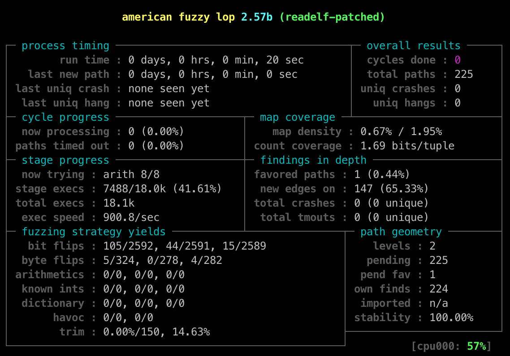

# e9AFL

A binary-only coverage-guided fuzzer built on top of AFL and e9patch project.

## Introduction

While testing softwares with AFL, developers usually need to instrument the codes for
collecting coverage information and memory sanitization. Hence, to deal with
binary-only fuzzing, dynamic binary instrumentation techniques such as 
QEMU tcg and Intel PIN are utilized. However, it still suffers from high overhead.  

To improve performance, researchers resort to static binary instrumentation
techniques, e.g, [Dyninst](https://dyninst.org/) moves the instrumented code region
into a new section and put an interception branch at the original position. 

Also, [RetroWrite](https://github.com/HexHive/retrowrite) statically
instruments the PIE binaries using reassembleable assembly.

Thanks to recent advances in static binary instrumentation, i.e., e9patch,
we can both instrument PIE binaries and non-PIE binaries painlessly.

For more details, please check [e9fuzzer.c](./e9fuzzer.c), 
[e9instrument.sh](./e9instrument.sh), and [e9patch](https://github.com/GJDuck/e9patch).

## Installation

1. Clone the repo

```bash
$ git clone --recursive https://github.com/HQ1995/e9AFL.git 
```

2. Build e9patch and AFL

```bash
$ ./bootstrap.sh
```

## Usage

1. Instrument the target

```bash
$ ./e9instrument.sh -b /usr/bin/readelf
```

2. Fuzz it with afl-fuzz

```bash
$ cd AFL

$ ./afl-fuzz -i ./testcases/others/elf/ -o /tmp/fuzz-output -m 9000 -- ../readelf-patched -a @@
```

If everything goes well, your terminal will be like



## Notes

Currently there is no sanitization support (ASAN) in e9AFL.

## Credit

e9patch project: https://github.com/GJDuck/e9patch
